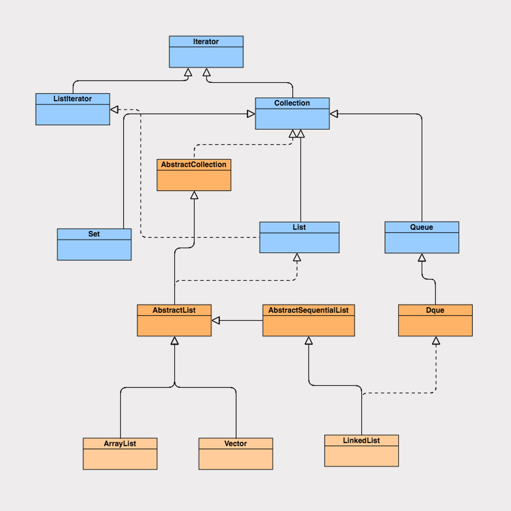

### 1.ArrayList
```java
public class ArrayList<E> extends AbstractList<E>
        implements List<E>, RandomAccess, Cloneable, java.io.Serializable {}
```
* 实现了 List 接口，继承了 AbstractList 抽象类，**底层是数组实现的**，并且实现了**自增扩容数组大小**;
* 实现了 Cloneable 接口和 Serializable 接口，所以他可以实现克隆和序列化;
* 实现了 RandomAccess 接口(这个接口其实是一个空接口，什么也没有实现)，标志着“只要实现该接口的 List 类，都能实现快速随机访问

```java
transient Object[] elementData;// 对象数组
```
ArrayList 是基于数组实现，由于 ArrayList 的数组是基于动态扩增的，所以并不是所有被分配的内存空间都存储了数据.
如果采用外部序列化法实现数组的序列化，会序列化整个数组。ArrayList 为了避免这些没有存储数据的内存空间被序列化，
内部提供了两个私有方法 writeObject 以及 readObject 来自我完成序列化与反序列化，从而在序列化与反序列化数组时节省了空间和时间.

因此使用 transient 修饰数组，是为了防止对象数组被其他外部方法序列化.

**使用ArrayList时系统性能**:
* 当 ArrayList 新增元素时，如果所存储的元素已经超过其已有大小，它会计算元素大小后再进行动态扩容，数组的扩容会导致整个数组进行一次内存复制。
因此，我们**在初始化 ArrayList 时，可以通过构造函数合理指定数组初始大小**，
这样有助于减少数组的扩容次数，从而提高系统性能.
```java
    public ArrayList(int initialCapacity) {
        // ...
    }
```

* 如果我们在初始化时就比较清楚存储数据的大小，就可以在 ArrayList 初始化时指定数组容量大小，
在添加元素时，**只在数组末尾添加元素**，那么 ArrayList 在大量新增元素的场景下，性能并不会变差，反而比其他 List 集合的性能要好.
```java
 /** 
  * 两种添加元素的方法
  * 相同之处:
  * 在添加元素之前，都会先确认容量大小，如果容量够大，就不用进行扩容；
  * 如果容量不够大，就会按照原来数组的 1.5 倍大小进行扩容，在扩容之后需要将数组复制到新分配的内存地址.
  * 不同之处:
  * 添加元素到任意位置，会导致在该位置后的所有元素都需要重新排列，而将元素添加到数组的末尾，在没有发生扩容的前提下，是不会有元素复制排序过程的.
  */
	public boolean add(E e) {
        // ...
    }
    public void add(int index, E element) {
        // ...
    }
```

* 删除元素: ArrayList 在每一次有效的删除元素操作之后，都要进行数组的重组，并且**删除的元素位置越靠前，数组重组的开销就越大**.
* 遍历元素: 由于 ArrayList 是基于数组实现的，所以在获取元素的时候是非常快捷的.

### 2.LinkedList
```java
public class LinkedList<E>
    extends AbstractSequentialList<E>
    implements List<E>, Deque<E>, Cloneable, java.io.Serializable {}
```
LinkedList 是**基于链表的数据结构实现的**.

### 3.HashMap
HashMap 是**基于哈希表的数据结构实现的**.
